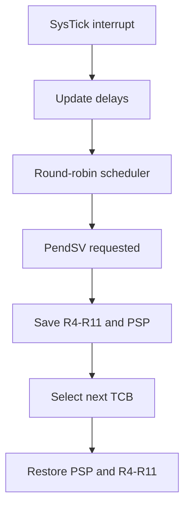

# Bare-Metal RTOS for STM32F407

A small preemptive real-time operating system developed from scratch for the STM32F407G-DISC1 development board.

The project implements Cortex-M4 startup, scheduling, context switching, task management, synchronization, inter-task communication, stack diagnostics, and fault capture without using an RTOS, STM32 HAL, LL drivers, or CMSIS device headers.

The goal is to understand and demonstrate the low-level mechanisms behind an embedded real-time kernel.

## Current Features

### Kernel

* Preemptive round-robin scheduler
* SysTick-based system timing
* PendSV-based context switching
* Statically allocated task control blocks and stacks
* Maximum of eight tasks, including the idle task
* Task creation, delay, termination, and automatic cleanup after task return
* Idle task using the Cortex-M4 `WFI` instruction
* Kernel and task state validation
* Interrupt-safe critical sections using `PRIMASK`

### Synchronization and Communication

* Counting semaphores
* Non-recursive mutexes with ownership validation
* FIFO mutex and semaphore wait queues
* Direct mutex ownership handoff
* Fixed-capacity message queues
* Blocking queue send and receive operations
* FIFO queue behavior with circular-buffer wraparound

### Diagnostics

* Per-task stack canaries
* Stack fill-pattern analysis
* Stack high-water-mark reporting
* Stack-overflow detection
* HardFault register capture
* Captured fault status registers:

  * CFSR
  * HFSR
  * MMFAR
  * BFAR
* Captured task index and active stack pointer

### Platform Support

* STM32F407G-DISC1 startup code
* Cortex-M4 vector table
* Custom linker script
* `.data` initialization and `.bss` clearing
* GPIO register definitions and drivers
* Board LED and user-button drivers
* UART4 polling driver
* OpenOCD flashing support

## Design Constraints

This project intentionally uses:

* C11 and ARM Thumb assembly
* Static memory allocation
* No dynamic allocation
* No vendor HAL or LL libraries
* No CMSIS device headers
* No standard C runtime
* Soft-float compilation
* Direct memory-mapped peripheral access

These constraints keep the kernel behavior explicit and make the low-level interactions with the Cortex-M4 visible.

## Architecture



Each task has a statically allocated stack and task control block. Hardware exception entry automatically saves R0–R3, R12, LR, PC, and xPSR. The PendSV handler saves and restores R4–R11 and each task’s Process Stack Pointer.

## Context Switching

The scheduler selects the next runnable task and stores its index in `osNextTask`. PendSV performs the architecture-specific context switch:

1. Read the current Process Stack Pointer.
2. Save R4–R11 on the current task’s stack.
3. Save the resulting stack pointer in the current task control block.
4. Load the next task’s saved stack pointer.
5. Restore R4–R11.
6. Return to thread mode using the Process Stack Pointer.

PendSV is configured as the lowest-priority kernel exception so that context switching occurs after higher-priority interrupt work completes.

## Project Structure

```text
bare-metal-rtos/
├── app/
│   └── demo/                 Current demonstration application
├── bsp/
│   └── stm32f407g-disc1/
│       ├── linker/           STM32F407 linker script
│       └── startup/          Vector table and reset handling
├── drivers/
│   └── stm32f4/
│       ├── include/          Driver interfaces
│       └── src/              GPIO, LED, button, and UART drivers
├── kernel/
│   ├── arch/arm/cortex-m4/   PendSV context-switch assembly
│   ├── include/              Kernel public and internal headers
│   └── src/                  Scheduler, timing, mutexes, queues, and semaphores
├── lib/                      Freestanding memory functions
├── tests/                    Target-side kernel tests
├── Makefile
└── README.md
```

## Requirements

* STM32F407G-DISC1 development board
* ARM GNU Toolchain
* GNU Make
* OpenOCD
* ST-Link interface
* GDB with ARM target support

Verify that the compiler is installed:

```bash
arm-none-eabi-gcc --version
```

## Building

Build the firmware from the repository root:

```bash
make clean
make
```

The generated files are placed in `build/`:

```text
build/rtos.elf
build/rtos.bin
build/rtos.map
```

Inspect the firmware memory usage:

```bash
arm-none-eabi-size build/rtos.elf
```

Example current build:

```text
   text    data     bss     dec     hex filename
   4812      12    8564   13388    344c build/rtos.elf
```

## Flashing

Connect the STM32F407G-DISC1 through its onboard ST-Link interface and run:

```bash
make flash
```

The Makefile uses OpenOCD with:

```text
interface/stlink.cfg
target/stm32f4x.cfg
```

## Debugging

Start OpenOCD:

```bash
openocd -f interface/stlink.cfg -f target/stm32f4x.cfg
```

In another terminal, start GDB:

```bash
arm-none-eabi-gdb build/rtos.elf
```

Connect to the target:

```gdb
target extended-remote localhost:3333
monitor reset halt
load
break main
continue
```

Useful inspection commands include:

```gdb
info registers
print osCurrentTask
print osNextTask
print _tcbs
print gHardFaultRecord
```

## Fault Capture

The HardFault handler determines whether the fault occurred while using MSP or PSP and records the automatically stacked exception frame.

The captured record contains:

* R0–R3
* R12
* LR
* PC
* xPSR
* Exception return value
* Active stack pointer
* Current task index
* Cortex-M4 fault status registers

The record can be inspected using GDB:

```gdb
print gHardFaultRecord
```

This provides post-mortem information without requiring console output from the fault handler.

## Testing

Target-side tests are currently provided for:

* Mutex ownership and mutual exclusion
* Semaphore handoff and count behavior
* Queue FIFO behavior
* Queue circular-buffer wraparound

The tests run directly on the STM32 target and expose pass/fail state through global variables and debugger breakpoints.

Automated selection and execution of all test images is planned as the next project improvement.

## Current Limitations

* All tasks currently have equal scheduling priority.
* Scheduling uses round-robin selection.
* Synchronization operations do not currently support timeouts.
* Queue and semaphore operations are not currently callable from interrupt handlers.
* Mutex priority inheritance is not yet implemented.
* Task stacks have a fixed compile-time size.
* Floating-point task context is not saved; the project currently uses soft-float compilation.
* Stack canaries provide diagnostic detection rather than hardware-enforced stack protection.
* Tests currently require manual target execution and debugger inspection.

## Planned Improvements

* Automated build targets for every kernel test
* Priority-based preemptive scheduling
* Round-robin scheduling between equal-priority tasks
* Mutex priority inheritance
* Blocking-operation timeouts
* ISR-safe queue and semaphore APIs
* Improved task-stack bounds validation
* Automated hardware test execution through OpenOCD and GDB

## Educational Focus

This project is intended to demonstrate understanding of:

* Cortex-M exception entry and return
* MSP and PSP stack operation
* Register context preservation
* Bare-metal startup and linking
* Preemptive scheduling
* Race conditions and critical sections
* Blocking synchronization primitives
* Circular buffers and wait queues
* Embedded fault diagnosis
* Static memory design
